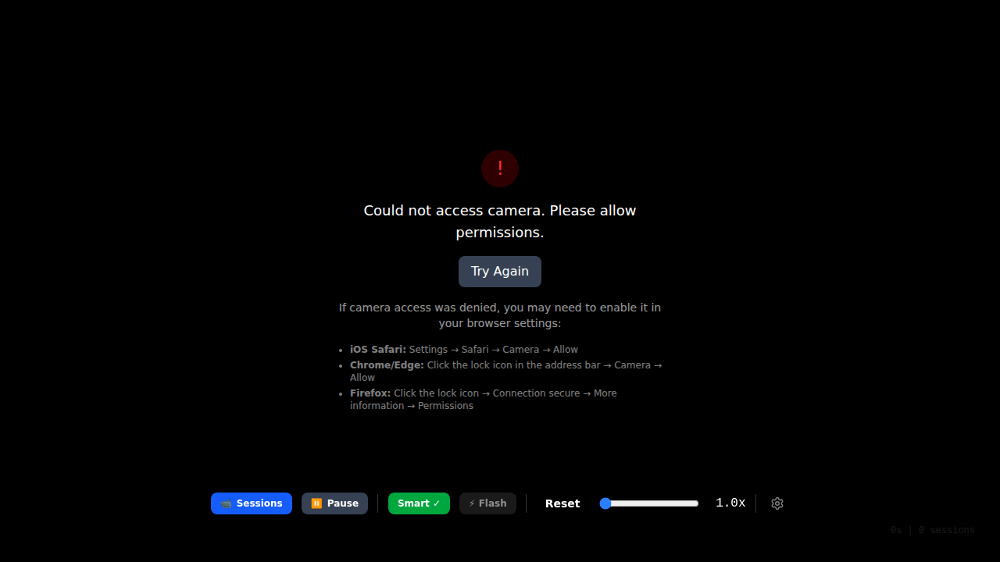
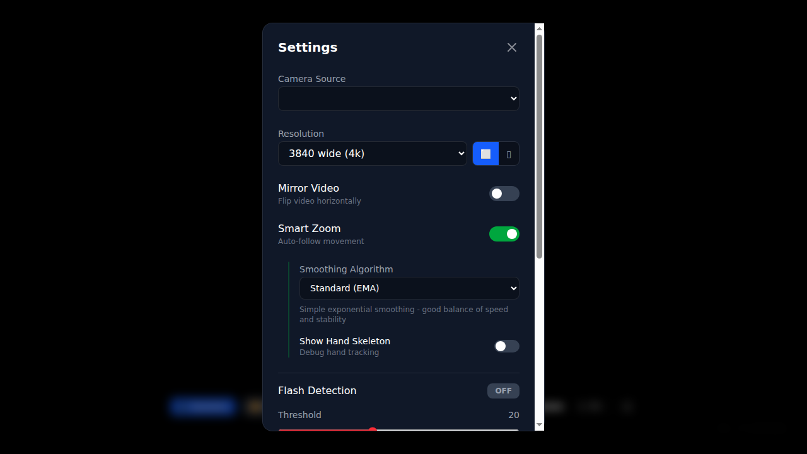

# Magic Monitor - App Walkthrough

*2026-02-18T02:28:35Z by Showboat dev*
<!-- showboat-id: 87cf7abc-bbd7-472a-b1f0-0ab0c669b0c4 -->

## Navigate to the deployed app

```bash
rodney open https://magic-monitor.surge.sh
```

```output
magic-monitor
```

```bash
rodney title
```

```output
magic-monitor
```

```bash
rodney screenshot -w 1280 -h 720 app-home.png
```

```output
app-home.png
```

```bash {image}
app-home.png
```



## Settings Panel

Click the settings gear icon to open the configuration panel.

```bash
rodney click '[data-testid=settings-button]' 2>/dev/null || rodney click 'button:has(svg)' 2>/dev/null || rodney js 'document.querySelector("button[title*=Settings], button[aria-label*=Settings]")?.click() || "no settings button found"'
```

```output
Clicked
```

```bash
rodney screenshot -w 1280 -h 720 settings-panel.png
```

```output
settings-panel.png
```

```bash {image}
settings-panel.png
```



## Accessibility Audit

Rodney can dump the accessibility tree to verify the app is accessible.

```bash
rodney ax-tree --depth 3
```

```output
[RootWebArea] "magic-monitor" (focusable, focused)
  [generic]
    [generic]
      [generic]
      [generic]
      [generic]
      [generic]
      [generic]
      [generic]
      [generic]
      [alert] (live=assertive, relevant=additions text)
      [Video] "Unable to play media." (disabled)
      [generic]
```

Close settings and verify the control bar buttons are accessible:

```bash
rodney ax-find --role button
```

```output
[button] "Try Again" backendNodeId=20 (focusable)
[button] backendNodeId=225
[button] backendNodeId=230
[button] backendNodeId=244
[button] backendNodeId=245
[button] backendNodeId=247
[button] "📹 Sessions" backendNodeId=35 (focusable)
[button] "⏸ Pause" backendNodeId=38 (focusable)
[button] "Smart ✓" backendNodeId=41 (focusable)
[button] "⚡ Flash" backendNodeId=3 (focusable)
[button] "Reset" backendNodeId=7 (focusable)
[button] "Settings" backendNodeId=11 (focusable, focused)
```

**Finding:** 5 buttons lack accessible names (backendNodeId 225, 230, 244, 245, 247). These are likely settings panel controls (toggles, orientation buttons) that need `aria-label` attributes.
